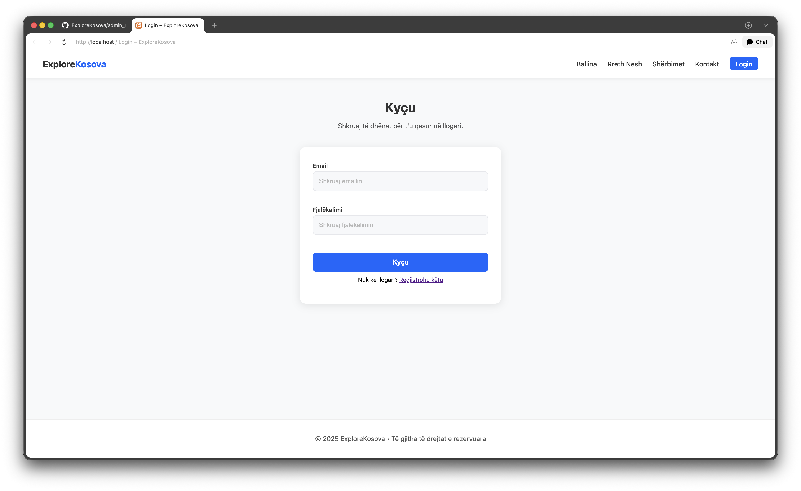
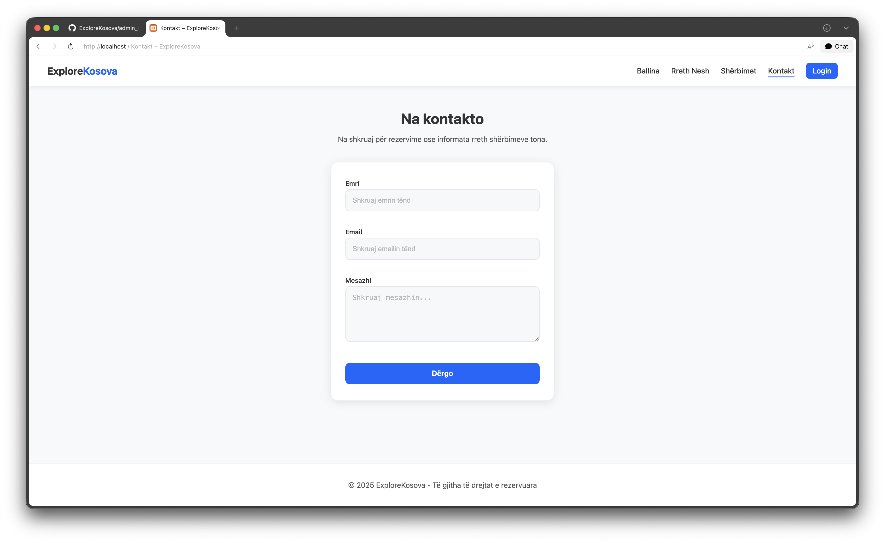
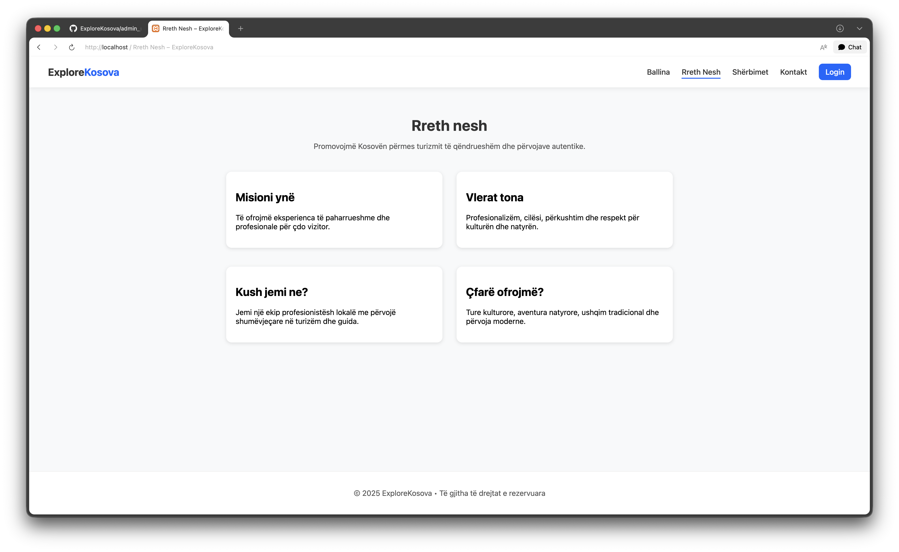

# 🌍 ExploreKosova

ExploreKosova është një web aplikacion i zhvilluar në PHP për promovimin e tureve turistike në Kosovë.  
Platforma ofron informacione për ture, shërbime turistike, kontakt me vizitorët dhe një dashboard administrativ për menaxhim të plotë të përmbajtjes.

Ky projekt është realizuar si projekt akademik me fokus në arkitekturë të mirë, siguri dhe dizajn modern.

---

## 📌 Përshkrim i Projektit

ExploreKosova synon të promovojë turizmin në Kosovë duke ofruar një platformë moderne ku vizitorët mund të:
- Shikojnë ture turistike
- Lexojnë për shërbimet
- Kontaktojnë ekipin përmes contact form

Administratorët kanë qasje në një **Admin Dashboard** për menaxhimin e përdoruesve, tureve dhe mesazheve.

---

## 🛠️ Teknologjitë e Përdorura

- PHP (PDO)
- MySQL
- HTML5
- CSS3
- JavaScript
- XAMPP
- phpMyAdmin

---

## 🧱 Arkitektura e Projektit

- Strukturë **MVC-like**
- Kombinim **OOP + Procedural PHP**
- PDO për komunikim të sigurt me databazën
- Ndarje e logjikës nga prezantimi
- Praktika bazë sigurie

---

## ⚙️ Funksionalitetet Kryesore

### 👤 Autentifikimi
- Register
- Login
- Logout
- Role: Admin / User

### 🧭 Menaxhimi i Tureve (Admin)
- Shtim tur
- Editim tur
- Fshirje tur
- Upload foto & PDF

### 📬 Contact Form
- Dërgim mesazhesh nga vizitorët
- Menaxhim i mesazheve nga admin dashboard

### 📊 Admin Dashboard
- Numri total i përdoruesve
- Numri total i mesazheve
- Numri total i tureve
- Lista e fundit e përdoruesve
- Lista e fundit e mesazheve
- Lista e fundit e tureve

---

## 📝 Menaxhimi i Përmbajtjes së Faqeve (CMS)

Projekti **ExploreKosova** përfshin një sistem të thjeshtë **CMS (Content Management System)** që lejon **vetëm administratorin** të menaxhojë përmbajtjen e faqeve kryesore:

- **Ballina (Home)**
- **Rreth Nesh (About Us)**

Ky funksionalitet mundëson që përmbajtja e faqeve të mos jetë statike, por të lexohet dhe përditësohet drejtpërdrejt nga databaza.

### 🔐 Akses & Siguri
- Vetëm përdoruesit me rol **Admin** kanë qasje
- I mbrojtur me:
  - Session-based authentication
  - CSRF Token
  - PDO Prepared Statements

### ⚙️ Funksionalitetet Kryesore
#### 🏠 Ballina (Home)
Administratori mund të përditësojë:
- Titullin kryesor (Hero Title)
- Nëntitullin (Hero Subtitle)
- Tekstin dhe linkun e butonit kryesor
- Titullin e seksionit informues
- Kartat informuese (titull, tekst, foto)

#### ℹ️ Rreth Nesh (About Us)
Administratori mund të përditësojë:
- Titullin e faqes
- Nëntitullin
- Seksionet informative (misioni, vlerat, kush jemi, çfarë ofrojmë)

### 🖥️ Paneli Administrativ
Menaxhimi i faqeve realizohet përmes:
- **Admin Dashboard → Menaxho Faqet**
- Ndërfaqe moderne me karta (cards)
- Mesazhe suksesi/gabimi të qendërzuara për feedback vizual

### 📦 Ruajtja e të Dhënave
- Përmbajtja ruhet në databazë (JSON për strukturat komplekse)
- Lejon përditësime të shpejta pa ndryshuar kodin burimor
   - Ky modul e bën projektin më fleksibël, më profesional dhe më afër një aplikacioni real web.

---

## 📁 Struktura e Projektit
```text
ExploreKosova/
├── app/
│   ├── config/
│   │   ├── config.php
│   │   └── Database.php
│   │
│   ├── controllers/
│   │   └── AuthController.php
│   │
│   ├── helpers/
│   │   └── auth.php
│   │
│   └── models/
│       ├── PageContent.php
│       └── Tour.php
│       └── User.php
│
├── includes/
│   ├── header.php
│   ├── navbar.php
│   └── footer.php
│
├── assets/
│   ├── css/
│   │   └── style.css
│   │
│   └── js/
│       └── main.js
│
├── uploads/
│   ├── images/
│   └── pdfs/
│
├── screenshots/
│   ├── home.png
│   ├── login.png
│   ├── dashboard.png
│   ├── tours.png
│   └── contact.png
│
├── index.php
├── services.php
├── service-details.php
├── contact.php
├── contact_submit.php
├── login.php
├── register.php
├── logout.php
├── dashboard.php
├── admin_tour_form.php
├── admin_tour_save.php
├── admin_tour_delete.php
├── admin_user_delete.php
├── admin_message_delete.php
├── admin_pages.php
├── admin_pages_save.php
└── README.md
```
---

## 📸 Screenshots

### 🏠 Ballina


### 🔐 Login


### 📊 Admin Dashboard


### 🧭 Turet


### 📬 Contact Form


### 🫆 About


---

## ⚙️ Instalimi Lokal (XAMPP)

1. Kopjo folderin **ExploreKosova** në:
   - macOS: /Applications/XAMPP/xamppfiles/htdocs/
   - Windows: C:\xampp\htdocs\

2. Hap **XAMPP Control Panel** dhe starto:
   - Apache
   - MySQL

3. Hap shfletuesin dhe shko te:
   - http://localhost/phpmyadmin

4. Krijo databazë me emrin:
   - explore_kosova

5. Importo SQL file (nëse ekziston) ose krijo tabelat:
   - users
   - tours
   - contact_messages

6. Konfiguro databazën në file-in:
   - app/config/config.php

Shembull:
```php
define('DB_HOST', 'localhost');
define('DB_NAME', 'explore_kosova');
define('DB_USER', 'root');
define('DB_PASS', '');
define('BASE_URL', 'http://localhost/ExploreKosova');
```
---

7. Hap projektin në shfletues:
   - http://localhost/ExploreKosova

---

### 👨🏻‍💻 Si të bëhet admin një user
 - Në phpMyAdmin ekzekuto:
```sql
UPDATE users SET role = 'admin' WHERE email = 'email@example.com';
```
---

### 🔐 Siguria
- PDO prepared statements (mbrojtje ndaj SQL Injection)
- CSRF tokens për veprimet sensitive
- Password hashing
- Kontroll i roleve për qasje në dashboard

---

## 👨‍💻 Autorët

- Erik Salihu
- Jasin Krasniqi
- Meris Misini

---

### 📄 Licenca
- Ky projekt është zhvilluar për qëllime akademike.

